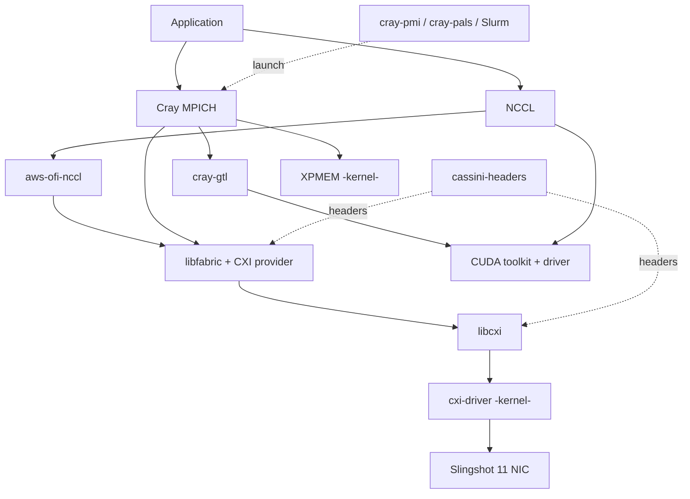

# Packages

One page per netstack component. Each page uses [Spack][spack] package names
(`libcxi`, `cxi-driver`, `cassini-headers`, …) so that a component is named the
same way whether it is built by the system or by a user.

## By layer

The netstack is a stack: MPI and NCCL sit on top of libfabric, which sits on the
Slingshot CXI libraries and driver, which drive the NIC hardware. Intra-node
traffic goes through XPMEM instead of the fabric.

## Provided by

Whether a component is **system**- or **user**-provided is a property of *how a
given environment is built*, not of the component itself. The "typical" column
below is the common case on Alps; the [tools][tools] report the truth for a
specific environment.

| Package | Layer | Typically provided by | Slingshot |
|---|---|---|:--:|
| [cray-mpich](cray-mpich.md)         | MPI            | user            | |
| [mpich](mpich.md)                   | MPI            | user            | |
| [openmpi](openmpi.md)               | MPI            | user            | |
| [cray-gtl](cray-gtl.md)             | GPU-aware MPI  | user            | |
| [libfabric](libfabric.md)           | fabric (OFI)   | user *or* system | ● |
| [libcxi](libcxi.md)                 | Slingshot      | user *or* system | ● |
| [cxi-driver](cxi-driver.md)         | Slingshot      | **system** (kernel) | ● |
| [cassini-headers](cassini-headers.md)| Slingshot      | system + user (build) | ● |
| [nccl](nccl.md)                     | GPU collectives| user            | |
| [aws-ofi-nccl](aws-ofi-nccl.md)     | GPU collectives| user            | ● |
| [cuda](cuda.md)                     | GPU runtime    | user            | |
| [cuda-driver](cuda-driver.md)       | GPU driver     | **system**      | |
| [xpmem](xpmem.md)                   | intra-node     | **system** (kernel) | |
| [cray-pmi](cray-pmi.md)             | launch         | user *or* system | |
| [pmix](pmix.md)                     | launch         | user            | |
| [cray-pals](cray-pals.md)           | launch         | system          | |
| [slurm](slurm.md)                   | launch         | **system**      | |

## Anatomy of a component page

Each page opens with a summary table (Spack name, layer, upstream, whether it
can be user-built) and then covers what the component is, the system vs. user
split, and how to identify it in a live environment.

[spack]: https://github.com/spack/spack-packages
[tools]: ../tools.md
