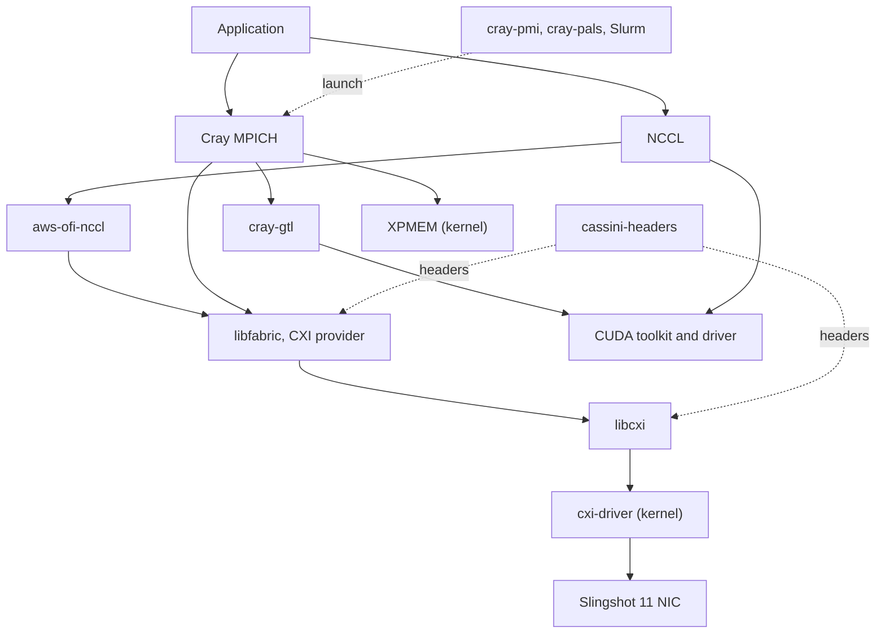

{#ref-pkg}
# Packages

There is one reference page per netstack component.
Every page is named after the [Spack](https://github.com/spack/spack-packages) package, so that a component has the same name whether it was built by the system or by a user.

{#ref-pkg-layers}
## How the components fit together

The netstack is a stack.
MPI and NCCL sit on top of libfabric, libfabric sits on the Slingshot CXI library and driver, and those drive the NIC.
Traffic that stays inside a node goes through XPMEM instead of through the fabric.

{#ref-pkg-catalogue}
## The components

Whether a component is provided by the system or by the user is a property of how a given environment was built, not a property of the component itself.
The tables below give the common case on Alps.
The [tools][ref-tools] report the truth for a specific environment.

{#ref-pkg-mpi}
### MPI

| Package | Role | Typically provided by |
|---|---|---|
| [cray-mpich][ref-pkg-cray-mpich] | MPI implementation, tuned for Slingshot. | User. |
| [mpich][ref-pkg-mpich] | Upstream MPI, ABI-compatible with Cray MPICH. | User. |
| [openmpi][ref-pkg-openmpi] | Alternative MPI implementation. | User. |
| [cray-gtl][ref-pkg-cray-gtl] | GPU transport layer for GPU-aware MPI. | User. |

{#ref-pkg-fabric}
### Fabric and Slingshot

| Package | Role | Typically provided by |
|---|---|---|
| [libfabric][ref-pkg-libfabric] | OFI fabric abstraction, and home of the CXI provider. | User or system. |
| [libcxi][ref-pkg-libcxi] | User-space library over the CXI driver. | User or system. |
| [cxi-driver][ref-pkg-cxi-driver] | Kernel driver for the Slingshot NIC. | System, as a kernel module. |
| [cassini-headers][ref-pkg-cassini-headers] | Hardware and ABI headers for Slingshot. | System and user, at build time. |

{#ref-pkg-gpu}
### GPU communication

| Package | Role | Typically provided by |
|---|---|---|
| [nccl][ref-pkg-nccl] | GPU collective communication. | User. |
| [aws-ofi-nccl][ref-pkg-aws-ofi-nccl] | Routes NCCL traffic over libfabric and CXI. | User. |
| [cuda][ref-pkg-cuda] | CUDA runtime and libraries. | User. |
| [cuda-driver][ref-pkg-cuda-driver] | Userspace stub for the NVIDIA kernel driver. | System. |

{#ref-pkg-intra-node}
### Intra-node

| Package | Role | Typically provided by |
|---|---|---|
| [xpmem][ref-pkg-xpmem] | Intra-node shared memory, for single-copy transfers. | System, as a kernel module. |

{#ref-pkg-launch}
### Launch

| Package | Role | Typically provided by |
|---|---|---|
| [cray-pmi][ref-pkg-cray-pmi] | Process management interface used by Cray MPICH. | User or system. |
| [pmix][ref-pkg-pmix] | Process management interface used by Open MPI. | User. |
| [cray-pals][ref-pkg-cray-pals] | Application launch service behind `mpiexec`. | System. |
| [slurm][ref-pkg-slurm] | Workload manager, and the launcher behind `srun`. | System. |

The components marked as Slingshot components on their own pages are [libfabric][ref-pkg-libfabric], [libcxi][ref-pkg-libcxi], [cxi-driver][ref-pkg-cxi-driver], [cassini-headers][ref-pkg-cassini-headers] and [aws-ofi-nccl][ref-pkg-aws-ofi-nccl].
These are the ones whose versions have to be checked against each other and against the host driver when a fabric problem is being diagnosed.

{#ref-pkg-anatomy}
## What is on a component page

Every component page has the same shape, so that two components can be compared by reading the same sections on each page:

1. a lead sentence and a summary table of fixed properties, namely the Spack package name, the layer, who provides it, whether a user can build it, whether it is a Slingshot component, and its upstream,
2. a *What it is* section describing the component and its place in the stack,
3. a *System or user* section giving the provenance rules for that component,
4. an *Identifying it* section giving the checks that establish which copy is in use,
5. an *Environment variables* section, where the component reads any, and
6. a *Related* section linking the neighbouring components.
