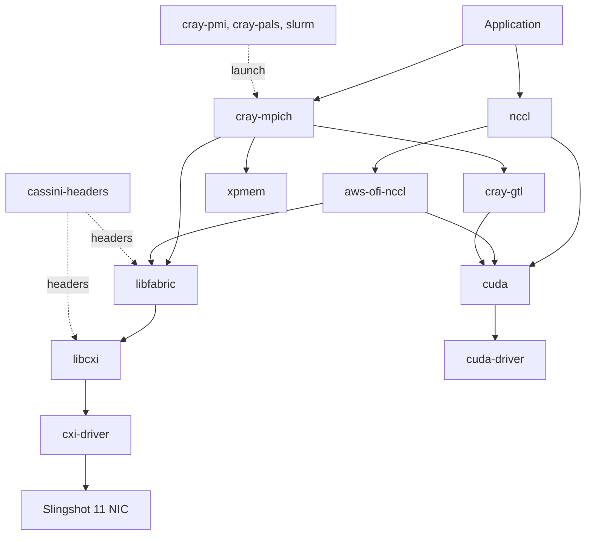

{#ref-pkg}
# Packages

There is one reference page per netstack component.
Every page is named after the [Spack](https://github.com/spack/spack-packages) package, so that a component has the same name whether it was built by the system or by a user.

{#ref-pkg-layers}
## How the components fit together

The netstack is a stack.
`cray-mpich` and `nccl` sit on top of `libfabric`, whose `cxi` provider reaches the NIC through `libcxi` and the `cxi-driver`.
Traffic that stays inside a node goes through `xpmem` instead of through the fabric.
The GPU components link the `cuda` runtime, which in turn runs against the host `cuda-driver`.

The two drivers form the bottom layer, because they are the only components tied to the running kernel.
Dotted edges carry build-time headers and job launch rather than application data.

{#ref-pkg-catalogue}
## The components

The components are ordered from the lowest level to the highest, so that the table reads in the same direction as the diagram above.
A component depends only on components that appear above it.

Whether a component is provided by the system or by the user is a property of how a given environment was built, and not a property of the component itself.
The table gives the common case on Alps, and the [tools][ref-tools] report the truth for a specific environment.

| Package | Layer | Role | Typically provided by |
|---|---|---|---|
| [cxi-driver][ref-pkg-cxi-driver] | Slingshot, kernel | Kernel driver for the Slingshot NIC. | System. |
| [cuda-driver][ref-pkg-cuda-driver] | GPU driver | Userspace stub for the NVIDIA kernel driver. | System. |
| [cuda][ref-pkg-cuda] | GPU runtime | CUDA runtime and libraries. | User. |
| [libcxi][ref-pkg-libcxi] | Slingshot | User-space library over the CXI driver. | User or system. |
| [cassini-headers][ref-pkg-cassini-headers] | Slingshot, headers | Hardware and ABI headers for Slingshot. | System and user, at build time. |
| [libfabric][ref-pkg-libfabric] | Fabric abstraction | OFI fabric abstraction, and home of the CXI provider. | User or system. |
| [xpmem][ref-pkg-xpmem] | Intra-node | Shared memory for single-copy transfers within a node. | System. |
| [cray-gtl][ref-pkg-cray-gtl] | GPU-aware MPI | GPU transport layer for GPU-aware MPI. | User. |
| [cray-pmi][ref-pkg-cray-pmi] | Launch | Process management interface used by Cray MPICH. | User or system. |
| [pmix][ref-pkg-pmix] | Launch | Process management interface used by Open MPI. | User. |
| [cray-pals][ref-pkg-cray-pals] | Launch | Application launch service behind `mpiexec`. | System. |
| [slurm][ref-pkg-slurm] | Launch | Workload manager, and the launcher behind `srun`. | System. |
| [cray-mpich][ref-pkg-cray-mpich] | MPI | MPI implementation, tuned for Slingshot. | User. |
| [mpich][ref-pkg-mpich] | MPI | Upstream MPI, ABI-compatible with Cray MPICH. | User. |
| [openmpi][ref-pkg-openmpi] | MPI | Alternative MPI implementation. | User. |
| [nccl][ref-pkg-nccl] | GPU collectives | GPU collective communication. | User. |
| [aws-ofi-nccl][ref-pkg-aws-ofi-nccl] | GPU collectives | Routes NCCL traffic over libfabric and CXI. | User. |

The Slingshot components are [cxi-driver][ref-pkg-cxi-driver], [libcxi][ref-pkg-libcxi], [cassini-headers][ref-pkg-cassini-headers], [libfabric][ref-pkg-libfabric] and [aws-ofi-nccl][ref-pkg-aws-ofi-nccl].
These are the ones whose versions have to be checked against each other, and against the host driver, when a fabric problem is being diagnosed.

{#ref-pkg-anatomy}
## What is on a component page

Every component page has the same shape, so that two components can be compared by reading the same sections on each page:

1. a lead sentence and a summary table of fixed properties, namely the Spack package name, the layer, who provides it, whether a user can build it, whether it is a Slingshot component, and its upstream,
2. a *What it is* section describing the component and its place in the stack,
3. a *System or user* section giving the provenance rules for that component,
4. an *Identifying it* section giving the checks that establish which copy is in use,
5. an *Environment variables* section, where the component reads any, and
6. a *Related* section linking the neighbouring components.
